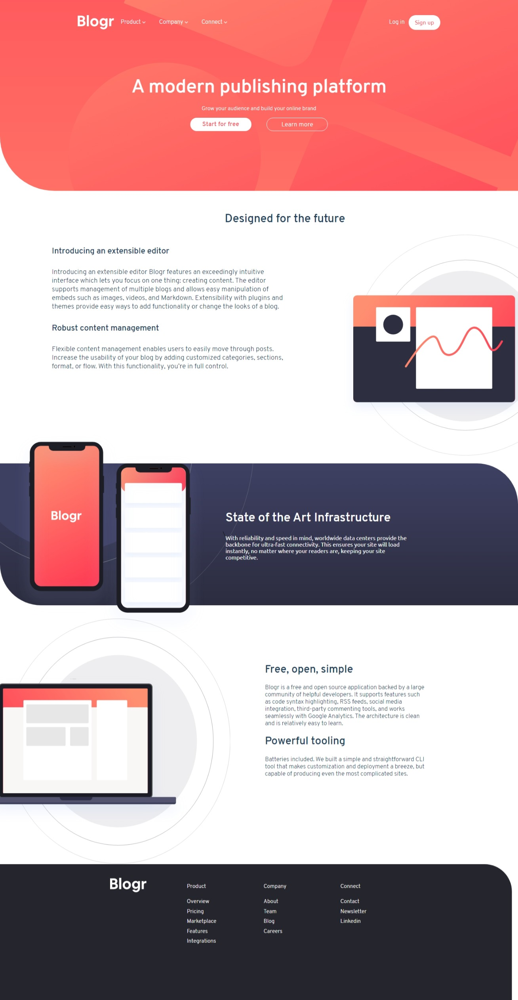
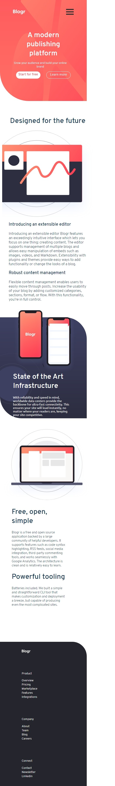

# Frontend Mentor - Blogr landing page solution

This is a solution to the [Blogr landing page challenge on Frontend Mentor](https://www.frontendmentor.io/challenges/blogr-landing-page-EX2RLAApP). Frontend Mentor challenges help you improve your coding skills by building realistic projects. 

## Table of contents

- [Overview](#overview)
  - [The challenge](#the-challenge)
  - [Screenshot](#screenshot)
  - [Links](#links)
- [My process](#my-process)
  - [Built with](#built-with)
  - [What I learned](#what-i-learned)
  - [Continued development](#continued-development)
  - [Useful resources](#useful-resources)
- [Author](#author)
- [Acknowledgments](#acknowledgments)


## Overview

### The challenge

Users should be able to:

- View the optimal layout for the site depending on their device's screen size
- See hover states for all interactive elements on the page

### Screenshot
### computer screen

### mobile screen



### Links

- Solution URL: [Add solution URL here](https://your-solution-url.com)
- Live Site URL: [Add live site URL here](https://your-live-site-url.com)

## My process

### Built with

- Semantic HTML5 markup
- CSS custom properties
- Flexbox
- CSS Grid

**Note: These are just examples. Delete this note and replace the list above with your own choices**

### What I learned

i learned how to use transform property on background image it can be done with following CSS code

```css
/* container that u want to set background for */
.laptopBg{
    width: 50%;
    position: relative;
    height: 100%;
}
.laptopBg::before{
    content: "";
  position: absolute;
  width: 100%;
  height: 100%;
  top: 0;
  background: url('/images/illustration-laptop-desktop.svg')no-repeat;
  background-size: 121% 100%;
  transform: rotateY(180deg);
}
```

### Continued development

  i did fail at making menu for mobile screen i did manage to make it in the end but it in my opinion looks really bad so i will try to work on making better menus in future 😤😤

### Useful resources

- [background transform](https://www.sitepoint.com/css3-transform-background-image/) - This helped me in applying transform property on background images


## Author

- Frontend Mentor - [@GigaGiorgadze](https://www.frontendmentor.io/profile/GigaGiorgadze)
- Twitter - [@giorgadze_11](https://www.twitter.com/giorgadze_11)


